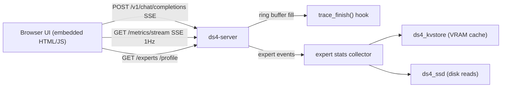

# ds4 Web UI — Chat + Live Monitor

Design for adding a browser UI to `ds4-server`: a **chat** view and a **monitor**
view showing, per prompt, performance metrics, which experts were called, how
they are stored in the VRAM cache, when they are fetched from disk, disk
performance, and live data.

Inspired by the Colibri project (https://github.com/JustVugg/colibri), which
solves the same problem for its CPU/NVMe MoE engine. Key ideas borrowed:

| Colibri concept | ds4 adaptation |
| --- | --- |
| `GET /health` → tiers `{vram, ram, disk, vram_gb, ram_gb}`, hwinfo, scheduler | `GET /health` → expert cache tiers (VRAM slab), slot/queue state, hwinfo |
| `GET /experts` → `{rows, cols, map, hits, seq}` (tier map + routing heat) | `GET /experts` → per-layer expert residency + heat from the expert profiler |
| `GET /profile` → rolling window of per-turn timings (`expert_disk_s`, `expert_wait_s`, `attention_s`, ...) | `GET /profile` → ring buffer of per-prompt records filled from `trace_finish()` |
| Extra SSE frame `data: {"colibri": {...stats...}}` before `[DONE]` | Extra SSE frame `data: {"ds4": {...stats...}}` before `[DONE]` |
| `web/dist` SPA served statically with traversal guard | Single embedded HTML/JS page served at `/` (no build step, no JS deps) |
| Dashboard polls `/health` every 5 s; `/experts`, `/profile` on interval | Dashboard subscribes to `GET /metrics/stream` (SSE, 1 Hz) — ds4 already speaks SSE |

## Architecture

### Server-side components (all C, in ds4_server.c + one new file)

1. **`ds4_metrics.h/.c` — stats collector (new file)**
   - Global, mutex-protected state:
     - `per-layer expert counters`: calls, VRAM hits, disk fetches (from cache lookup path).
     - `disk stats`: bytes read, read count, cumulative/avg latency, current throughput (from ds4_ssd.c read completion).
     - `prompt ring buffer`: last 64 completed prompts `{id, ts, prompt_tokens, completion_tokens, prefill_s, ttft_s, gen_s, tok_s, cache_read_tokens, cache_write_tokens, expert_hits, expert_misses, disk_bytes, disk_s}`.
   - Filled from `trace_finish()` (ds4_server.c:10130) and `server_progress_cb()` (ds4_server.c:10699) plus new counters in the expert cache lookup and SSD read paths.

2. **New endpoints in `client_main()` routing (ds4_server.c:12811)**
   - `GET /` and `GET /index.html` → embedded UI (single HTML string, gzip optional).
   - `GET /health` → `{status, model, slots, expert_cache: {capacity, resident, vram_bytes, hits, misses, hit_rate}, disk: {...}}`.
   - `GET /experts` → per-layer arrays: `{layers, experts_per_layer, resident: bitmap/ranges, heat: top-N per layer}` sourced from the existing expert profiler (`ds4_expert_profile_record`) and kvstore residency.
   - `GET /profile` → the prompt ring buffer as JSON.
   - `GET /metrics/stream` → SSE, one JSON snapshot per second (live chart data).

3. **Instrumentation hooks (minimal invasiveness)**
   - Expert routing per token: record top-k expert IDs per layer where routing is known (increment `calls[layer][expert]`).
   - Cache lookup: at the VRAM-cache hit/miss decision increment hits/misses; on miss, tag the fetch.
   - Disk read completion in ds4_ssd.c: accumulate bytes + latency.
   - All counters are lock-free-ish (atomics or one short mutex per snapshot build).

### Browser UI (single file, no build step)

Served from a C string (`ds4_web_ui.h`, generated or hand-written). Two tabs:

- **Chat**: message list, composer, streaming via `fetch` POST to
  `/v1/chat/completions` with `stream:true` (SSE parse, same as Colibri's
  `extractSSE`). Live badge: token count, tok/s, TTFT; after completion, the
  `{"ds4": {...}}` trailer stats. Minimal markdown rendering (bold/code/headers),
  XSS-safe by building DOM nodes, never `innerHTML` with model output.
- **Monitor**:
  - Per-prompt table from `/profile` (tok/s, TTFT, prefill/decode split, cache tokens).
  - Live charts from `/metrics/stream`: tok/s, prefill t/s, disk MB/s, avg disk read latency.
  - Expert panel: grid layers × experts (canvas), color = tier (VRAM green / disk gray),
    brightness = call heat, flash on call — same idea as Colibri's Brain page.
  - Tier bar: resident vs total experts, VRAM bytes used.
  - Disk panel: cumulative bytes, reads, hit rate gauge.

## Phasing

1. **P1 — metrics core**: `ds4_metrics.h/.c`, `/health`, `/profile`, `/metrics/stream`, hooks. Build-only validation.
2. **P2 — embedded UI**: chat tab + monitor tab consuming P1 endpoints.
3. **P3 — expert map**: `/experts` endpoint + Brain-like canvas.
4. **P4 — polish**: SSE trailer stats in chat stream, docs, README update.
